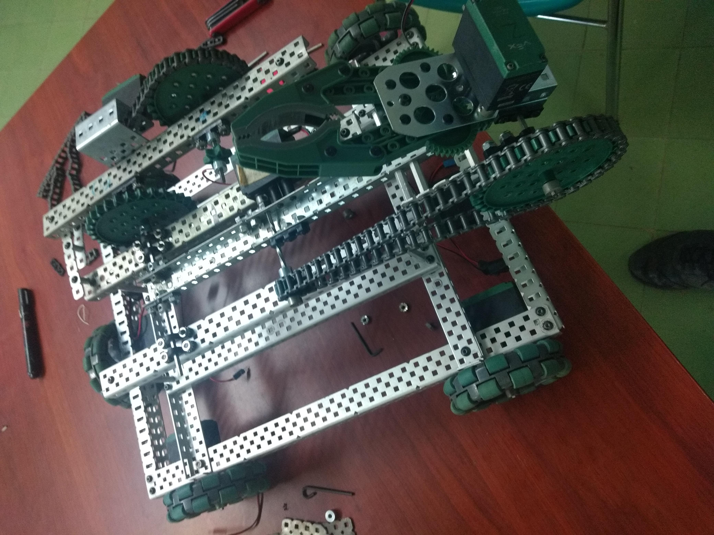
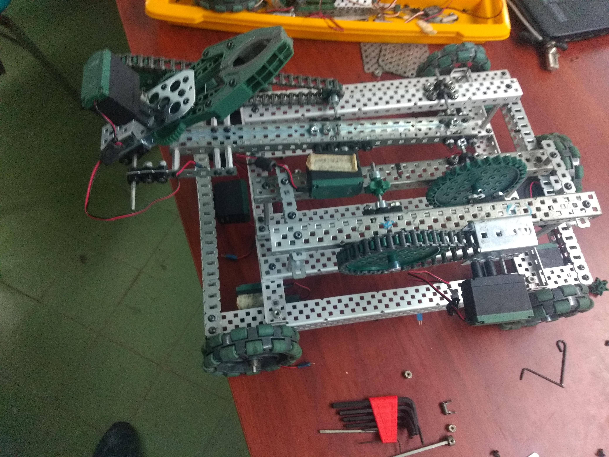
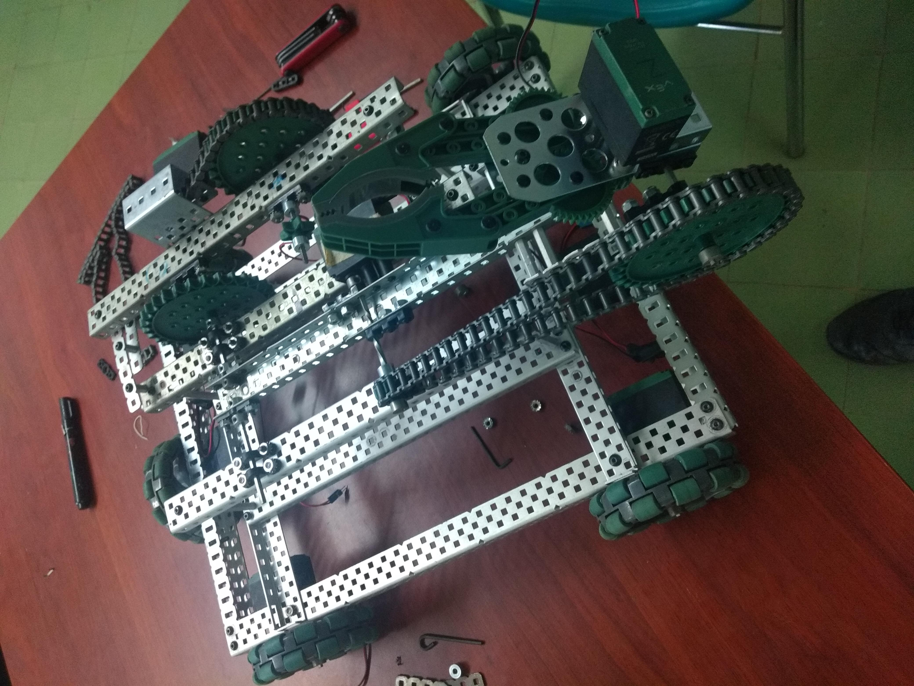
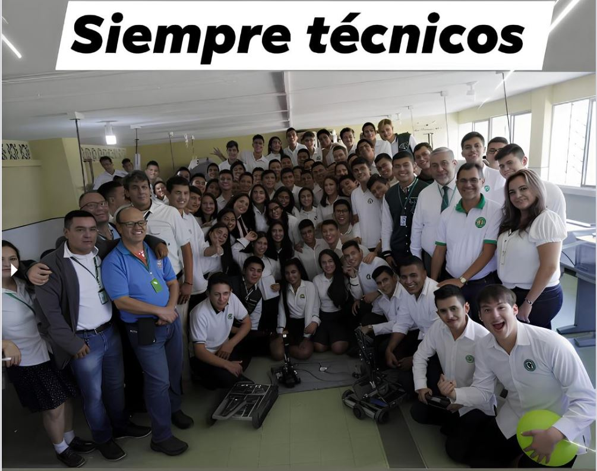

# # 🦾 Proyecto: Brazo Robótico VEX con Control PID y Sistema de Tracción Omni

## 📖 Descripción General

Este proyecto presenta el desarrollo de un **brazo robótico móvil construido con el kit VEX EDR**, equipado con **ruedas omnidireccionales**, **transmisión por cadena**, y **control de brazo articulado con motorreductores VEX**.
El sistema se controla mediante **VEXcode V5 (C++ o Python)** e integra un **algoritmo PID básico** para el control de posición del brazo, junto con un modo de conducción manual (teleoperado).

El objetivo principal es **demostrar los fundamentos de la robótica aplicada**: control de movimiento, retroalimentación con sensores y diseño mecánico con limitaciones reales de peso, fricción y precisión.

---

## ⚙️ Características Técnicas

| Componente                   | Descripción                                           |
| ---------------------------- | ----------------------------------------------------- |
| **Plataforma**               | VEX EDR metálica de aluminio con estructura modular   |
| **Tracción**                 | 4 ruedas omni (mecanum-like) con doble eje motorizado |
| **Transmisión**              | Cadenas metálicas y engranajes de acero reforzado     |
| **Motores principales**      | 6 motores VEX 2-wire / 3-wire (con opción V5 Smart)   |
| **Actuadores**               | Brazo articulado + garra operada por servomotor       |
| **Controlador**              | VEX V5 Brain con mando inalámbrico                    |
| **Lenguaje de programación** | C++ y Python (VEXcode V5)                             |
| **Control de brazo**         | Algoritmo PID proporcional-derivativo simple          |
| **Modos de operación**       | Teleoperado y autónomo básico                         |

---

## 🧠 Objetivos del Proyecto

1. Implementar un sistema robótico con capacidades de **manipulación y movilidad coordinada**.
2. Desarrollar un control de posición del brazo con **retroalimentación PID**.
3. Promover el **aprendizaje práctico** en mecánica, electrónica y programación aplicada.
4. Ofrecer una base modular para futuras implementaciones autónomas (navegación, visión, sensores).

---

## 📸 Estructura Mecánica

| Vista superior                                            | Vista lateral                                            |
| --------------------------------------------------------- | -------------------------------------------------------- |
|  |  |

| Detalle del brazo robótico                          | Terminado                                                     |
| --------------------------------------------------- | ---------------------------------------------------------------------- |
|  |  |

> 🔧 *Las imágenes muestran el montaje estructural con cadenas, engranajes y motores en configuración paralela, además de la garra robótica en el extremo frontal del brazo.*

---

## 💻 Código Fuente

El código está implementado en **VEXcode V5 (C++)**, con una versión equivalente en **Python**, disponible en el repositorio:

📂 **Archivos principales**

* `main.cpp` → Código principal con control PID y teleoperado
* `main.py` → Versión alternativa en Python
* `README.md` → Este documento
* `/docs/` → Diagramas, planos y calibración
* `/images/` → Fotografías y esquema de montaje

**Características del software:**

* Control arcade para chasis (joystick izquierdo + derecho).
* Control PID de brazo con límites superior e inferior.
* Control de garra con toggle automático (abrir/cerrar).
* Presets de posición del brazo (recogida, elevación).
* Bloqueo de motores en reposo (modo hold).

---

## 🔩 Esquema de Puertos Recomendado

| Componente                | Puerto V5 | Tipo                 | Observación                     |
| ------------------------- | --------- | -------------------- | ------------------------------- |
| Motor Izquierdo Delantero | 1         | Motor                | Dirección normal                |
| Motor Izquierdo Trasero   | 2         | Motor                | Dirección normal                |
| Motor Derecho Delantero   | 3         | Motor                | Invertido                       |
| Motor Derecho Trasero     | 4         | Motor                | Invertido                       |
| Motor del Brazo           | 5         | Motor Reducción 36:1 | Control PID                     |
| Motor de la Garra         | 6         | Servo                | Control de apertura/cierre      |
| Sensor Límite Superior    | A         | Digital              | Detiene movimiento hacia arriba |
| Sensor Límite Inferior    | B         | Digital              | Detiene movimiento hacia abajo  |

---

## 🔍 Control PID del Brazo

El sistema utiliza un controlador **Proporcional–Derivativo (PD)** para regular la posición del brazo según su encoder.
La ecuación general aplicada es:

[
\text{Salida} = K_p \times e + K_i \times \int e ,dt + K_d \times \frac{de}{dt}
]

**Constantes iniciales de calibración:**

```text
Kp = 0.6
Ki = 0.0002
Kd = 4.0
```

> Estas constantes se deben ajustar experimentalmente según el peso del brazo, el tipo de reducción y el tipo de motor.

---

## 🧰 Calibración y Seguridad

1. **Calibrar encoders:** definir posición 0° (brazo abajo) y 120° (brazo alto).
2. **Verificar topes físicos** antes de ejecutar código autónomo.
3. **Evitar cargas excesivas** en el motor del brazo.
4. **Ajustar PID** para evitar vibraciones o sobreoscilaciones.
5. **Inspeccionar cadenas y engranajes** antes de cada prueba.

---

## 🧩 Extensiones Futuras

* Integración de **visión artificial (VEX Vision Sensor)** para manipulación autónoma.
* Implementación de **trayectorias trapezoidales (Motion Profiling)**.
* Añadir control de **velocidad adaptativo (feed-forward)** según el peso del brazo.
* Comunicación por **bluetooth o WiFi** para control remoto avanzado.

---

## 🧑‍🔬 Créditos y Licencia

**Autor:** *Proyecto de Robótica – VEX EDR Experimental*
**Versión:** 1.0 — Noviembre 2025
**Licencia:** MIT License

> Este proyecto es de uso **educativo y demostrativo**. Diseñado para enseñar conceptos de control, mecánica y electrónica de forma segura y responsable.

---

## 🧭 Enlaces de Referencia

* [Documentación oficial de VEXcode V5](https://www.vexrobotics.com/vexcode-v5)
* [Guía Markdown para GitHub](https://guides.github.com/features/mastering-markdown/)

---

## 🖼️ Vista Final del Sistema


> 📷 *Brazo robótico VEX ensamblado y calibrado para pruebas de control PID y operación remota.*
